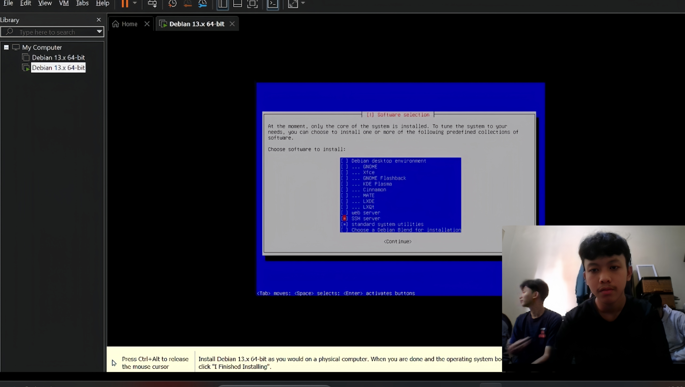
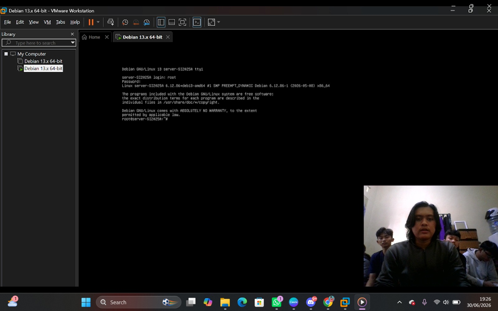
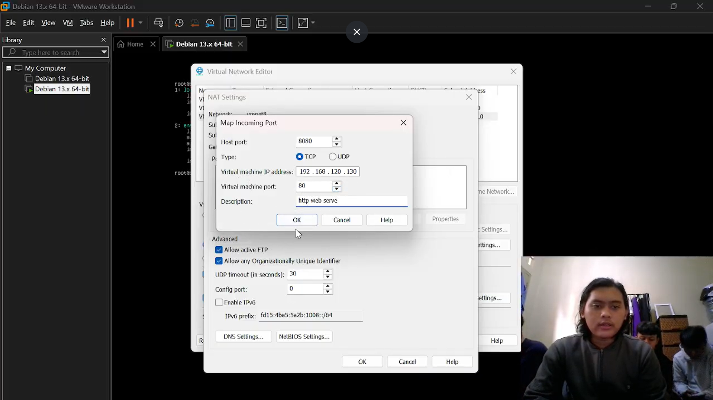

Laporan Tugas Kelompok: Instalasi Debian 13 Headless Web Server
Mata Kuliah: Sistem Operasi (SI-25)
Program Studi: Sistem Informasi, Universitas Galuh
     
# Laporan Tugas Kelompok: Instalasi Debian 13 Headless Web Server
Mata Kuliah: Sistem Operasi (SI-25)
Program Studi: Sistem Informasi, Universitas Galuh

## 👥 Anggota Kelompok Window 1 (Kelas SI-2025A)
1. Akbar Romadona - NIM: 7020250010
2. Muhammad Rifai Hakim - NIM: 7020250012
3. Ruly Aditia Budi R - NIM: 7020250018
4. Afifah Rahma - NIM: 7020250021
5. Alya Pebyanti A - NIM: 7020250008
6.	Royhan Muhammad Sabila - NIM: 7020250013 

## 🎯 Spesifikasi Lingkungan Server
* **Hypervisor:** VMware Workstation Pro
* **Sistem Operasi:** Debian 13 (Bookworm) - Headless (CLI / Tanpa GUI)
* **IP Address VM (Guest):** `192.168.x.x` (Gunakan perintah `ip a` pada antarmuka ens33 untuk melihat IP VM Anda)
* **Port Forwarding:** Host Port `8080` -> VM Port `80` (HTTP)

## 🛠️ Langkah-Langkah & Dokumentasi Praktikum

### ### 1. Instalasi Debian 13 Headless (Server Murni)
Pada tahap awal ini, sistem operasi Debian 13 diinstal ke dalam *virtual machine* dengan parameter yang secara spesifik dirancang untuk kebutuhan server berkinerja tinggi dan efisien.

* **Pemilihan Metode Instalasi (Mode Teks / *Headless*):**
  Berbeda dengan instalasi sistem operasi untuk pengguna awam yang menggunakan antarmuka grafis (*Graphical Install*), pada praktikum ini dipilih opsi **"Install"** standar yang berbasis teks. Pendekatan *headless* ini dipilih untuk mereplikasi lingkungan server produksi di dunia nyata. Dengan meniadakan antarmuka grafis, server akan menghemat alokasi RAM dan beban prosesor (CPU) secara drastis, sehingga seluruh daya komputasi dapat difokuskan murni untuk menjalankan layanan utama.

* **Skema Partisi Hard Disk (Guided - Single Partition):**
  Manajemen ruang penyimpanan menggunakan metode otomatis yakni **"Guided - use entire disk"** pada kapasitas *virtual disk* sebesar 20 GB. Skema pemisahan direktori yang dipilih adalah **"All files in one partition"**. Metode ini disarankan karena seluruh hierarki direktori sistem root Linux (seperti `/boot`, `/var`, `/usr`, `/etc`) digabungkan ke dalam satu wadah partisi yang sama (`/`), sehingga mencegah *error* kehabisan ruang penyimpanan pada direktori spesifik.

* **Konfigurasi Identitas Jaringan (Hostname):**
  Identitas mesin diatur dengan nama spesifik: `server-SI2025A`. *Hostname* berfungsi sebagai pengenal unik mesin di dalam jaringan lokal agar mudah dipantau dan diidentifikasi tanpa harus menghafal alamat IP.

* **Pemilihan Perangkat Lunak (Software Selection):**
  Ini adalah tahap paling krusial dalam menciptakan lingkungan *headless server*. Seluruh centang pada opsi *Debian desktop environment* dan *GNOME* dikosongkan agar sistem tidak terbebani paket visual. Tanda centang (*) hanya diaktifkan secara eksklusif untuk **SSH Server** (untuk kebutuhan akses *remote* jarak jauh) dan **standard system utilities** (untuk utilitas perintah dasar Linux).
  
  

* **Pemasangan Bootloader GRUB:**
  Pada akhir instalasi, program *bootloader* GRUB diinstal pada *primary drive* (`/dev/sda`). Instalasi ke dalam *Master Boot Record* (MBR) ini sangat vital karena GRUB bertugas memuat inti sistem operasi (Kernel) sesaat setelah mesin dinyalakan. Setelah berhasil, sistem melakukan *reboot* dan menampilkan prompt *login* CLI (Command Line Interface).
  
  

### 2. Konfigurasi User Sudo & Pembaruan Sistem (Update Repositori)
Secara bawaan (*default*), instalasi Debian 13 versi minimal (mode teks) tidak menyertakan utilitas manajemen hak akses `sudo`. Sistem hanya mengandalkan satu akun *Superuser* (`root`) yang memiliki kendali absolut. Untuk alasan keamanan dan penerapan *Principle of Least Privilege* (prinsip hak akses minimal), pengoperasian server sehari-hari tidak disarankan menggunakan akun `root` secara langsung. Oleh karena itu, pendelegasian hak administratif kepada *user* biasa mutlak diperlukan.

* **Eskalasi Hak Akses Sementara (Login Root):**
  Untuk memulai konfigurasi inti, pengguna harus masuk ke dalam mode *Superuser* menggunakan perintah `su -` lalu memasukkan *password* root. Tanda *prompt* terminal akan berubah dari lambang dolar (`$`) menjadi pagar (`#`), menandakan pengguna memiliki akses penuh (*unrestricted access*) untuk mengubah sistem berkas Linux.

* **Pembaruan Indeks Repositori dan Paket Sistem:**
  Sebelum memasang utilitas baru, sistem harus disinkronisasikan dengan peladen (server) repositori resmi Debian untuk menambal celah keamanan (*security patch*).
  - `apt update`: Bertugas mengunduh dan memperbarui daftar indeks paket (katalog) dari repositori Debian.
  - `apt upgrade -y`: Bertugas mengunduh dan menginstal pembaruan perangkat lunak untuk seluruh paket yang sudah terpasang. Parameter `-y` (*yes*) ditambahkan untuk mengotomatiskan konfirmasi persetujuan sehingga administrator tidak perlu menekan tombol 'Y' secara manual.

* **Instalasi Utilitas Sudo (*Superuser DO*):**
  Paket `sudo` diinstal agar *user* biasa (non-root) dapat mengeksekusi perintah tingkat tinggi yang spesifik tanpa perlu mengetahui sandi dari akun `root`. Utilitas ini juga menyediakan log rekam jejak (audit) yang mencatat siapa saja yang menjalankan perintah administratif.

* **Pendaftaran User ke Grup Administratif:**
  Agar *user* biasa (misalnya `kelompok1`) sah menggunakan perintah `sudo`, *user* tersebut harus didaftarkan ke dalam grup keamanan sistem yang bernama "sudo". Perintah yang digunakan adalah `usermod -aG sudo kelompok1`.
  - Flag `-a` (*append*): Memastikan user *ditambahkan* ke grup baru tanpa menghapusnya dari grup-grup lama.
  - Flag `-G` (*groups*): Menentukan grup sekunder yang akan dimasuki oleh pengguna tersebut.

* **Penerapan Kebijakan Grup (Reboot):**
  Linux membaca status keanggotaan grup pada saat inisialisasi sesi (*login*). Oleh karena struktur hak akses telah diubah, *virtual machine* harus dimuat ulang (`reboot`) agar sistem mereset sesi dan mengaplikasikan daftar izin hak akses yang baru.

**Eksekusi Perintah Konfigurasi pada Terminal Root (`#`):**
```bash
# 1. Mensinkronkan daftar repositori dan meningkatkan versi paket sistem
apt update && apt upgrade -y

# 2. Menginstal utilitas eskalasi hak akses (sudo)
apt install sudo -y

# 3. Mendaftarkan user standar ke dalam grup administratif sudo
usermod -aG sudo kelompok1

# 4. Melakukan restart mesin untuk mengaktifkan perubahan izin hak akses
reboot
```
* *[Tambahkan screenshot hasil uji coba perintah sudo oleh user biasa di bawah ini]*
   *(Catatan: sesuaikan nama file dengan screenshot Anda)*

### 3. Instalasi Web Server Nginx & Utilitas Jaringan Dasar
Setelah hak akses *sudo* berhasil dikonfigurasi, langkah selanjutnya adalah mentransformasi *server* Debian yang masih kosong ini menjadi sebuah *web server* fungsional. Karena sistem diinstal dalam mode *headless* (tanpa GUI), instalasi paket harus dilakukan secara langsung melalui *Command Line Interface* (CLI). Praktikum ini menggunakan **Nginx** (dibaca: *Engine-X*), sebuah *web server* dan *reverse proxy* modern yang dikenal karena kecepatannya, stabilitasnya, serta konsumsi memori yang sangat rendah dibandingkan Apache.

Selain Nginx, beberapa utilitas dasar (paket penunjang) juga diinstal secara bersamaan untuk membantu proses diagnostik jaringan dan manajemen berkas di masa mendatang.

* **Penggabungan Instalasi Paket Tambahan:**
  Perintah instalasi dieksekusi secara simultan untuk memasang empat paket sekaligus:
  - `net-tools`: Menyediakan sekumpulan program jaringan klasik untuk Linux (seperti `ifconfig` untuk melihat IP, `netstat` untuk melihat *port* yang terbuka, dan `route`). Sangat penting untuk melacak konfigurasi jaringan pada *server headless*.
  - `curl`: Merupakan utilitas baris perintah yang berfungsi untuk mentransfer data melalui berbagai protokol jaringan (HTTP, HTTPS, FTP). Dalam praktikum ini, `curl` akan digunakan untuk menguji fungsionalitas Nginx dari dalam sistem lokal (*loopback*).
  - `git`: Sistem kendali versi (VCS). Meski tidak digunakan langsung dalam langkah ini, `git` adalah standar industri untuk mengunduh (*clone*) *source code website* atau repositori skrip dari GitHub ke dalam server.
  - `nginx`: Paket utama *web server* itu sendiri yang bertugas mendengarkan (*listening*) dan melayani lalu lintas masuk HTTP pada *port* 80.
  - Parameter `-y`: Ditambahkan di akhir perintah untuk menekan *prompt* interaktif (menyetujui otomatis), sehingga instalasi berjalan lancar tanpa interupsi.

* **Manajemen Daemon (*Background Service*) menggunakan Systemd:**
  Hanya menginstal Nginx tidak serta-merta membuatnya otomatis beroperasi terus-menerus. Sistem operasi modern Debian 13 menggunakan inisialisasi `systemd` (dipanggil dengan perintah `systemctl`) untuk mengelola *service* yang berjalan di latar belakang (disebut *daemon*).
  - `sudo systemctl start nginx`: Perintah ini secara eksplisit memerintahkan inti sistem operasi (*kernel*) untuk mengeksekusi biner program Nginx pada sesi saat ini dan segera membuka *port* web.
  - `sudo systemctl enable nginx`: Perintah ini sangat krusial untuk otomatisasi. Ia bertugas membuat tautan simbolis (*symlink*) di dalam *runlevel* sistem agar *service* Nginx secara permanen disertakan pada saat proses *booting* berlangsung. Dengan begitu, Nginx akan langsung hidup (*auto-start*) secara otomatis setiap kali VM Debian di-restart atau dihidupkan ulang, tanpa perlu diperintah manual oleh administrator.

**Eksekusi Perintah pada Terminal User Standar (`$`):**
```bash
# Menginstal utilitas jaringan, alat transfer data, manajemen versi, dan Nginx secara bersamaan
sudo apt install net-tools curl git nginx -y

# Menyalakan service Nginx secara manual untuk pertama kalinya
sudo systemctl start nginx

# Mendaftarkan Nginx ke dalam daftar startup agar berjalan otomatis saat booting
sudo systemctl enable nginx
```
* *[Tambahkan screenshot status active running dari Nginx]*
  

### 4. Pembuatan Halaman Web Profil Kelompok (Modifikasi Document Root)
Secara bawaan (*default*), saat Nginx pertama kali terinstal dan dijalankan, peladen ini akan menyajikan sebuah halaman web statis bawaan yang bertuliskan "Welcome to nginx!". Berkas halaman awal ini secara standar berlokasi di dalam direktori sistem yang dikenal sebagai *Document Root*, lebih tepatnya pada *path* `/var/www/html/index.html`. Untuk memenuhi tujuan praktikum dan memberikan identitas pada server, halaman bawaan tersebut harus ditimpa dengan dokumen HTML orisinal yang memuat profil kelompok.

* **Memahami Izin Direktori Web dan Penggunaan Editor Nano:**
  Direktori `/var/www/html/` adalah wilayah hierarki sistem berkas yang sangat dilindungi. Secara standar, izin memodifikasi fail di dalam direktori ini hanya dimiliki oleh akun administrator (`root`) atau *user* yang berwenang (seperti `www-data`). Oleh karena itu, *user* standar seperti `kelompok1` tidak bisa langsung menyuntingnya begitu saja. Kita harus memanggil **Nano**—yakni editor teks ringan yang berjalan langsung di dalam terminal—dengan memberikan awalan perintah `sudo` agar mendapatkan eskalasi hak akses (*superuser privileges*).
  
* **Penyesuaian Struktur Markup HTML:**
  Setelah perintah `sudo nano /var/www/html/index.html` dieksekusi, layar terminal akan berubah sepenuhnya menjadi kanvas editor teks. Seluruh baris kode bawaan milik Nginx dihapus (*clear*). Sebagai gantinya, baris-baris kode HTML baru diketikkan secara manual dengan struktur:
  - Tag `<title>` di dalam `<head>` untuk menetapkan judul *tab* pada peramban web (*browser*).
  - Tag *Heading* `<h1>` di dalam `<body>` yang memuat teks "Server Debian 13 Kelompok X" sebagai tajuk utama situs.
  - Sekumpulan tag Paragraf `<p>` yang memuat informasi spesifik, yakni daftar anggota kelompok (Andi, Budi, Citra) serta sebuah kalimat semboyan operasional: *"CLI is freedom"*.

* **Menyimpan Berkas dan Memuat Ulang (Restart) Layanan Nginx:**
  Setelah proses penyusunan baris kode HTML selesai dilakukan di dalam antarmuka Nano, fail disimpan dengan menggunakan pintasan (*shortcut*) *keyboard* bawaan Linux:
  - Menekan `Ctrl + O` (Write Out) untuk menyimpan teks, dilanjutkan dengan `Enter` guna menyetujui nama *file*.
  - Menekan `Ctrl + X` (Exit) untuk keluar dari Nano dan mengembalikan layar ke *prompt* perintah terminal biasa.
  
  Meskipun berkas fisik HTML telah berubah, peladen web sering kali masih menyimpan versi lama dokumen tersebut di dalam *buffer cache* memori RAM demi kecepatan akses. Oleh sebab itu, sangat diwajibkan untuk memaksa daemon web membaca ulang sumber berkasnya dengan cara melakukan *restart service* (memulai ulang layanan) menggunakan utilitas `systemctl`.

**Eksekusi Perintah pada Terminal (`$`):**
```bash
# 1. Membuka dan mengedit file index utama menggunakan teks editor Nano
sudo nano /var/www/html/index.html

# (Lakukan penghapusan kode lama, pengetikan kode profil HTML baru, lalu simpan dengan Ctrl+O -> Enter -> Ctrl+X)

# 2. Memuat ulang daemon Nginx agar seluruh perubahan konten dan cache segera diterapkan
sudo systemctl restart nginx
```
* *[Tambahkan screenshot pengeditan index.html menggunakan nano editor]*
  
  
### 5. Konfigurasi Jaringan Tingkat Lanjut (NAT Port Forwarding) dan Verifikasi Akses
Secara arsitektur, *virtual machine* (VM) Debian 13 beroperasi di dalam mode jaringan tersendiri yang disebut **NAT (Network Address Translation)** melalui antarmuka `VMnet8` milik VMware. Dalam mode ini, mesin Guest (Debian) berada di dalam sebuah sub-jaringan yang sepenuhnya terisolasi, sehingga mesin fisik Host (Windows/Linux utama) tidak dapat secara langsung mengakses *port* internal milik Guest dengan mengetikkan alamat IP internalnya di *browser*. 

Untuk memecahkan masalah isolasi ini dan menyimulasikan bagaimana sebuah server lokal mengekspos layanannya ke jaringan luar publik, digunakanlah mekanisme **Port Forwarding** (Penerusan Port).

* **Mekanisme dan Logika Port Forwarding:**
  Konfigurasi ini bertindak sebagai jembatan (*bridge*). Kita mengatur sebuah aturan (Rule) di dalam perangkat lunak hypervisor yang menginstruksikan: *"Jika ada permintaan lalu lintas masuk ke komputer fisik (Host) melalui port tertentu, tangkap lalu lintas tersebut, lalu teruskan secara transparan ke alamat IP komputer virtual (Guest) menuju port layanannya."*

* **Langkah Konfigurasi Pemetaan Port di VMware Workstation:**
  1. **Identifikasi Alamat IP Guest:** Di dalam terminal Debian, eksekusi perintah `ip a` atau `ip address`. Perhatikan alamat IP logis yang tertera pada antarmuka jaringan utama (biasanya `ens33`, misalnya `192.168.80.130`).
  2. **Membuka Pengelola Jaringan Virtual:** Beralih ke sistem operasi Host (Windows). Pada menu atas VMware, buka tab **Edit** lalu pilih **Virtual Network Editor...** (berikan izin *Administrator* jika diminta oleh *User Account Control*).
  3. **Pengaturan NAT (NAT Settings):** Pilih tipe jaringan `VMnet8` (NAT), kemudian klik tombol **NAT Settings...**.
  4. **Menambahkan Aturan Penerusan (Add Port Forwarding):** Klik **Add...** dan masukkan parameter berikut:
     - **Host Port:** `8080` (Ini adalah *port* di mesin fisik Windows yang akan kita buka).
     - **Type:** `TCP` (Protokol standar untuk lalu lintas situs web HTTP).
     - **Virtual machine IP address:** Masukkan alamat IP Debian yang dicatat pada langkah pertama.
     - **Virtual machine port:** `80` (Ini adalah *port* *default* tempat daemon Nginx mendengarkan permintaan jaringan).
  5. Simpan seluruh konfigurasi dengan mengeklik **OK** dan **Apply**.

* **Dokumentasi Jendela Form Aturan NAT Settings Port Forwarding VMware:**
  Tangkapan layar berikut mendokumentasikan jendela *NAT Settings* secara rinci. Pengaturan *Port Forwarding* ini bersifat menetap (*persistent*), sehingga koneksi yang masuk menuju *localhost* di *port* 8080 pada Windows akan secara instan ditranslasikan dan diarahkan masuk menuju *port* 80 (HTTP) pada server berbasis CLI Debian 13.
  
  

* **Pengujian Akhir (End-to-End Testing) Melalui Komputer Host:**
  Tahap konklusif dari seluruh rangkaian praktikum administrasi server ini adalah memverifikasi fungsionalitas server web. 
  
  Sebuah peramban web (*web browser* seperti Chrome, Firefox, atau Edge) dibuka pada komputer Host. Pada bilah alamat (*address bar*), URL diketik dengan rincian `http://localhost:8080` (atau menggunakan alamat IP *loopback* `http://127.0.0.1:8080`). 
  
  * **Dokumentasi Halaman Profil Kelompok yang Berhasil Diakses dari Browser Host:**
  Tangkapan layar akhir ini membuktikan keberhasilan praktikum secara penuh. Peramban web merespons dan berhasil merender kode HTML secara visual menjadi sebuah antarmuka halaman yang menampilkan judul, daftar nama anggota, serta *motto* kelompok. 
  
  Keberhasilan memuat halaman situs ini membuktikan bahwa: 1) Proses instalasi OS Debian *headless* berjalan tanpa kecacatan, 2) Hak akses *sudo* dan utilitas jaringan dasar terkonfigurasi dengan semestinya, 3) *Web Server* Nginx berhasil berjalan stabil di latar belakang, dan 4) Konfigurasi translasi lalu lintas (NAT Port Forwarding) telah sukses memetakan *request* lintas arsitektur sistem operasi.
  
  

## 🎥 Link Video Demo
[Tonton Video Demo Pengerjaan Tugas Kelompok di YouTube / Google Drive](https://youtube.com/...)

## 📝 Kesimpulan

Berdasarkan keseluruhan rangkaian aktivitas praktikum instalasi, konfigurasi, hingga tahap pengujian yang telah dilaksanakan, berikut adalah simpulan mendalam serta poin-poin penting yang didapatkan selama melakukan setup server Linux headless:

### 1. Efisiensi Arsitektur Server Headless (CLI)
* [cite_start]**Optimalisasi Sumber Daya Jaringan & Perangkat Keras:** Penonaktifan lingkungan antarmuka grafis (GUI/Desktop Environment) pada tahap *Software Selection* terbukti secara masif mampu menekan penggunaan sumber daya virtual machine, baik dari segi alokasi RAM maupun kapasitas ruang penyimpanan[cite: 7, 9, 67]. [cite_start]Sistem dapat berjalan dengan beban kerja minimal karena beroperasi dalam mode teks murni[cite: 9].
* [cite_start]**Simulasi Lingkungan Produksi Riil:** Penggunaan mode *headless* (CLI) ini berhasil mereplikasi karakteristik lingkungan server produksi yang sesungguhnya di dunia industri, di mana aspek stabilitas, kecepatan pemrosesan instruksi, dan efisiensi performa menjadi prioritas utama di atas kenyamanan visual[cite: 3].

### 2. Manajemen Hak Akses dan Prinsip Keamanan Sistem
* [cite_start]**Penerapan Prinsip *Least Privilege* via Sudo:** Langkah konfigurasi akun pengguna standar (`kelompok1`) yang didaftarkan ke dalam grup administratif `sudo` memberikan pemahaman penting mengenai aspek keamanan siber[cite: 54, 80]. [cite_start]Operasional harian server tidak boleh dilakukan langsung menggunakan akun administrator tertinggi (`root`) demi menghindari paparan risiko keamanan[cite: 53, 73].
* [cite_start]**Perlindungan Inti Berkas Sistem:** Dengan mengisolasi hak akses *superuser*, risiko terjadinya kesalahan penulisan perintah fatal yang berpotensi merusak atau menghapus struktur direktori utama Linux secara permanen dapat diminimalkan[cite: 53]. [cite_start]Selain itu, utilitas `sudo` memberikan kontrol penuh dan rekam jejak audit (log) yang lebih bersih terhadap setiap perintah tingkat tinggi yang dieksekusi[cite: 73].

### 3. Implementasi Layanan Web Berkinerja Tinggi dengan Nginx
* [cite_start]**Kemudahan Dokumentasi & Deployment Konten:** Praktikum ini membuktikan bahwa Nginx merupakan *engine web server* yang sangat tangguh namun memiliki struktur konfigurasi yang ramah pengguna[cite: 2, 86]. [cite_start]Proses penyebaran halaman statis profil kelompok dapat dilakukan secara instan dan efisien cukup dengan memodifikasi berkas indeks utama pada direktori root dokumen di `/var/www/html/index.html`[cite: 94, 97].
* [cite_start]**Manajemen Daemon Berbasis Systemd:** Aktivitas mengaktifkan, memulai ulang, dan memantau kondisi kesehatan layanan Nginx menggunakan utilitas *systemd* (`systemctl status`) memberikan pemahaman mendalam tentang bagaimana sebuah *background service* atau daemon dikelola secara konsisten dalam lingkungan distribusi Linux[cite: 89, 90, 91].

### 4. Abstraksi Jaringan Virtual dan Mekanisme Port Forwarding
* [cite_start]**Menembus Isolasi Jaringan NAT:** Penggunaan tipe jaringan NAT (`VMnet8`) secara bawaan mengisolasi mesin Guest dari jaringan luar komputer utama untuk alasan proteksi[cite: 8, 116]. [cite_start]Melalui praktikum ini, dibuktikan bahwa mekanisme *Port Forwarding* bertindak sebagai pintu gerbang jembatan yang sangat aman untuk meneruskan lalu lintas data[cite: 113, 117].
* [cite_start]**Translasi Alamat dan Port Jaringan:** Aturan pemetaan arus lalu lintas dari Host Port `8080` menuju alamat IP virtual Guest pada port HTTP `80` memberikan pemahaman krusial mengenai konsep translasi alamat jaringan (*Network Address Translation*)[cite: 117, 118, 119]. [cite_start]Hal ini memungkinkan aplikasi web yang terisolasi di dalam server virtual dapat diakses secara transparan oleh peramban web di komputer fisik luar[cite: 121].

[cite_start]Secara garis besar, praktikum ini tidak hanya memberikan keterampilan teknis dalam melakukan instalasi OS Linux Debian 13, melainkan juga menanamkan konsep fundamental yang kuat mengenai administrasi server, manajemen hak akses operasional, serta arsitektur jaringan virtual yang menjadi pilar utama dalam pengelolaan infrastruktur IT modern[cite: 1, 2].
